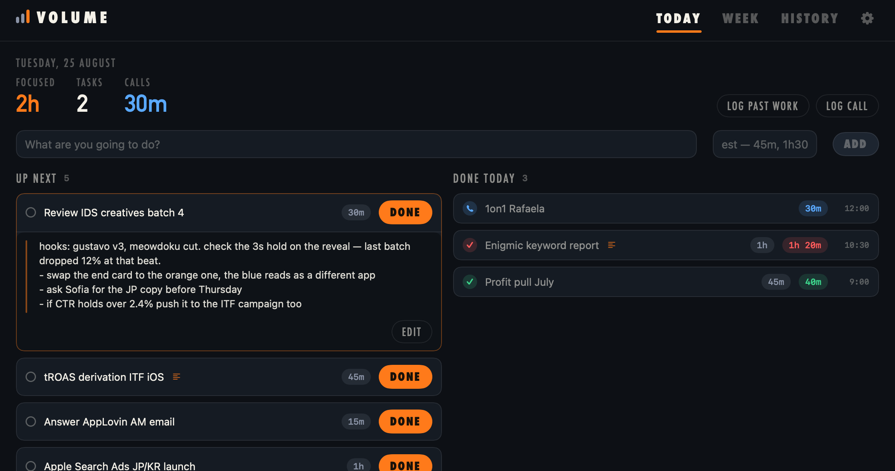
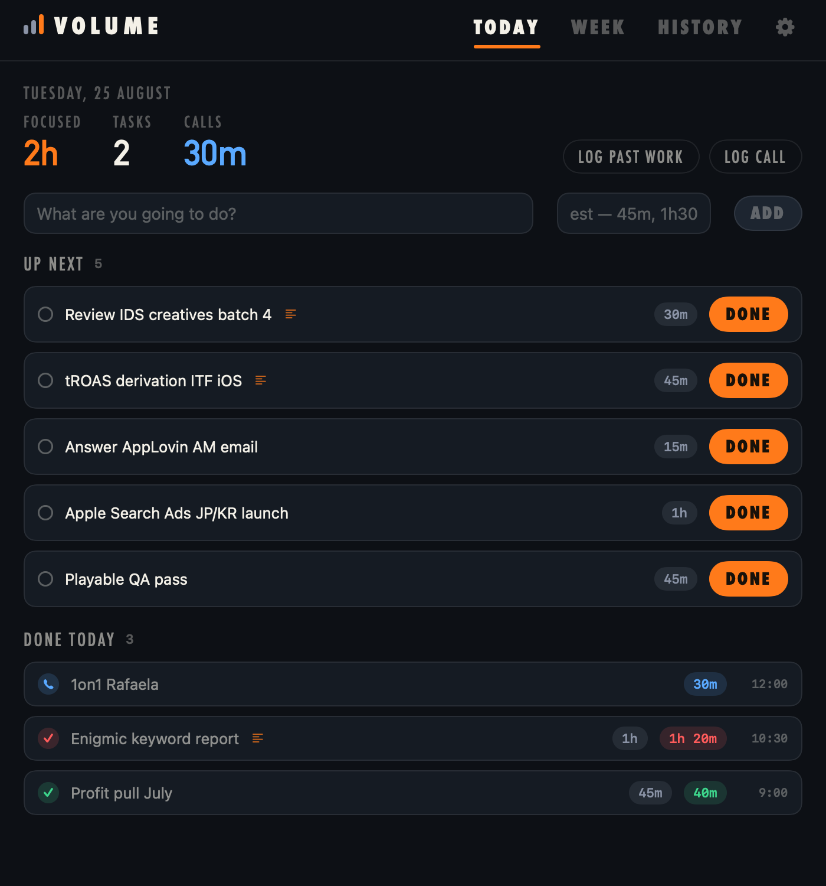
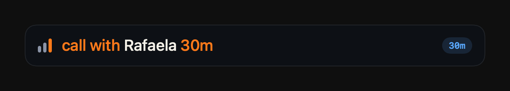
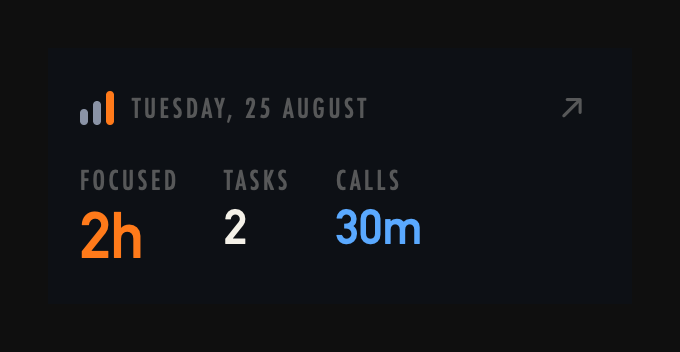

# Volume

**Race your ghost.** A native macOS productivity tracker: plan tasks with a
time estimate, log what they actually took, and beat last week's focused
minutes — while your meeting time syncs itself from your calendar.

No Electron, no server, no cloud, no account. One SwiftUI app, one SQLite
file, built in seconds with the Xcode Command Line Tools.


## Install

```
git clone https://github.com/guilhermea-infinity/volume.git
cd volume
./build-app.sh --install
```

Requirements: macOS 14+ and the Xcode Command Line Tools, version 16 or newer —
`xcode-select --install`, or `softwareupdate --list` if yours predates Swift 6.
No other dependencies: nothing to install, no package manager, no accounts.

That's it — about a minute of compiling and `Volume.app` lands in /Applications.
Building locally also means no Gatekeeper quarantine to fight; the app is signed
ad-hoc on your own machine. Run `./build-app.sh` without `--install` to get the
bundle in `build/` instead.

## What it does


- **Today** — quick-add a task with an estimate (`45m`, `1h30`, `1:30`, `90`
  all parse). Hit **Done** and it asks what it actually took: green badge =
  within estimate, red = over. Log past work and ad-hoc calls too.
- **Week** — focused minutes vs last week, with a **ghost**: a marker showing
  exactly where last-week-you was at this moment. Beat the week and the bar
  goes green. Tiles for tasks done, estimation accuracy, best day, call load.
- **History** — every day archived, grouped by week.

Drag a row up or down to reorder Up next: the rest step aside as you go, it
clicks against your trackpad as you pass each one, and the order sticks. New
tasks land at the bottom, under whatever you've sorted.

Click a row to unfold its notes — a well that grows with what you write, saves
as you type, and leaves a small mark on the row so you can see which tasks are
carrying one. Every drawer also holds **Edit** — a title and an estimate while
the task is still up next, plus the actual and the day it landed once it's done.



Finishing a task pays out: the row lands lit, the focused number kicks and rolls
up, and a burst of bars comes off it — green and bigger when you beat your own
estimate. Passing the ghost sets off its own. Sound is a toggle in Settings, and
every animation respects Reduce Motion.

Up next and Done today sit side by side at full width, and stack when you pull
the window in to half a screen.



**Quick add from anywhere**: press **⇧⌘Space** — a floating one-liner pops up.
Type `review creatives 30m`, Enter. Tab opens the full app.


The field colors what the parser recognised — the opener that makes it a
meeting, the duration it lifts off the end — so you can see the command land as
you type it. Open the line with `call with …` (or `meeting with …`) and it logs
as call time already done, rather than an estimate waiting in Up next; the chip
turns blue so you can see which one you're about to get.



**Menu bar scoreboard**: the mark sits in the menu bar all day. Click it for
today's focused time, tasks and calls without switching windows.



**Calendar sync**: meetings (2+ attendees, not declined) auto-log as call time
via EventKit — the OS does the syncing, the app never touches the network.
Add your Google/work account in System Settings → Internet Accounts with
Calendars enabled, grant access on first launch, done. Calls are tracked but
excluded from the focused score: the point is to watch that share shrink.

**Silent auto-tagging**: finished tasks are classified locally — Analysis,
Creative, Campaign, Comms, Admin — and the Week view gains a *Where the time
went* breakdown you never had to maintain. Nothing is asked at entry time, and
a task the classifier isn't confident about stays untagged rather than wrong.

Two backends, picked automatically:

| Backend | When | Notes |
|---|---|---|
| Local lexicon + sentence embeddings | Always | Instant, offline, zero dependencies. Ships with `NaturalLanguage`. |
| Apple on-device language model | Built against the macOS 26 SDK | Compiled in via `#if canImport(FoundationModels)`. Install Xcode 26 or its Command Line Tools and rebuild — it activates itself. |

Neither sends anything anywhere.

**Settings** (⚙, top right): dark / light / system appearance, sound on finish,
calendar sync toggle + status, auto-tagging backend + re-tag, start at login.


## Details

- Data: single SQLite file at `~/Library/Application Support/Volume/volume.db`.
  Yours forever, trivially backed up.
- Weeks run Monday–Sunday. Right-click any row to delete it.
- Calendar-sourced entries reconcile on every sync (edits/deletions propagate);
  manually logged calls are never touched — don't log calendar meetings by
  hand or they'll double-count.
- Calendar entries you edit by hand stop being replaced by the sync — the
  calendar keeps owning every entry you leave alone.
- Headless UI previews for development: `.build/debug/Volume --render <dir>`
  with `VOLUME_DB` / `VOLUME_RENDER_APPEARANCE` / `VOLUME_RENDER_W` / `_H` env
  overrides — it also writes a filmstrip of the completion burst, the only way
  to review an animation from a still. `--parse "<line>"` checks the quick-add
  grammar.

MIT licensed.
