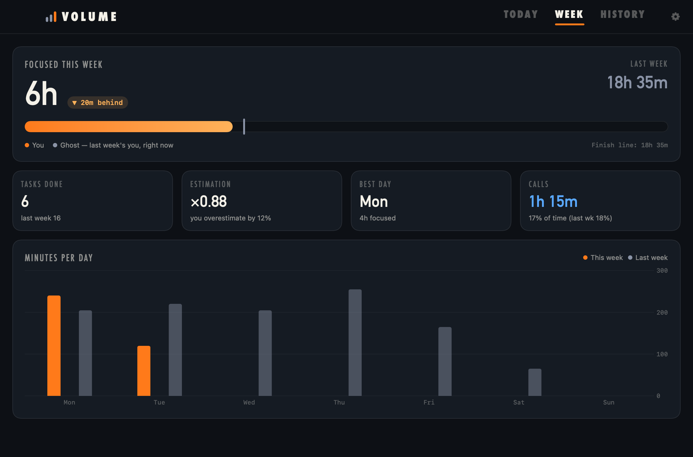
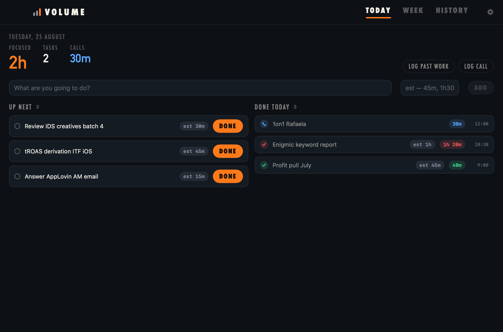
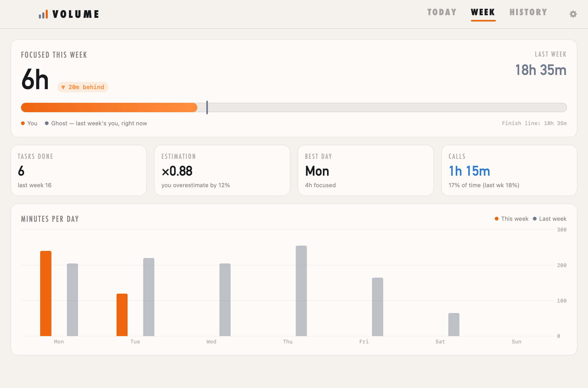

# Volume

**Race your ghost.** A native macOS productivity tracker: plan tasks with a
time estimate, log what they actually took, and beat last week's focused
minutes — while your meeting time syncs itself from your calendar.

No Electron, no server, no cloud, no account. One SwiftUI app, one SQLite
file, built in seconds with the Xcode Command Line Tools.



## Install

```
git clone https://github.com/guilhermea-infinity/volume.git
cd volume
./build-app.sh --install
```

Requirements: macOS 14+, Xcode Command Line Tools (`xcode-select --install`).
That's it — `Volume.app` lands in /Applications. Building locally also means
no Gatekeeper quarantine to fight.

## What it does



- **Today** — quick-add a task with an estimate (`45m`, `1h30`, `1:30`, `90`
  all parse). Hit **Done** and it asks what it actually took: green badge =
  within estimate, red = over. Log past work and ad-hoc calls too.
- **Week** — focused minutes vs last week, with a **ghost**: a marker showing
  exactly where last-week-you was at this moment. Beat the week and the bar
  goes green. Tiles for tasks done, estimation accuracy, best day, call load.
- **History** — every day archived, grouped by week.

**Quick add from anywhere**: press **⇧⌘Space** — a floating one-liner pops up.
Type `review creatives 30m`, Enter. Tab opens the full app.


**Calendar sync**: meetings (2+ attendees, not declined) auto-log as call time
via EventKit — the OS does the syncing, the app never touches the network.
Add your Google/work account in System Settings → Internet Accounts with
Calendars enabled, grant access on first launch, done. Calls are tracked but
excluded from the focused score: the point is to watch that share shrink.

**Settings** (⚙): dark / light / system appearance, calendar sync toggle +
status, start at login.



## Details

- Data: single SQLite file at `~/Library/Application Support/Volume/volume.db`.
  Yours forever, trivially backed up.
- Weeks run Monday–Sunday. Right-click any row to delete it.
- Calendar-sourced entries reconcile on every sync (edits/deletions propagate);
  manually logged calls are never touched — don't log calendar meetings by
  hand or they'll double-count.
- Headless UI previews for development: `.build/debug/Volume --render <dir>`
  with `VOLUME_DB` / `VOLUME_RENDER_APPEARANCE=light` env overrides.

MIT licensed.
